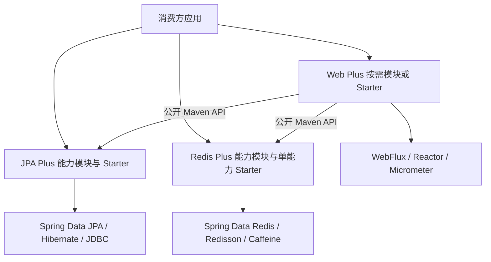

# AI Plus

AI Plus 是 JPA Plus、Redis Plus 与 Web Plus 的 Java monorepo。三个能力族共享一个 Git 仓库和质量门禁，并保留清晰的模块边界；39 个 Maven 模块独立维护版本。

## 仓库结构

| 目录 | 职责 | 模块数量 |
| --- | --- | ---: |
| `jpa-plus/` | JPA 查询、字段治理、拦截、审计、多数据源与分片 | 8 |
| `redis-plus/` | Redis 核心、锁、缓存、限流、幂等、队列与治理 | 19 |
| `web-plus/` | WebFlux、安全、防护、日志、文档、Excel、消息与任务 | 12 |

根 Gradle composite build 会把 Web Plus 使用的 JPA Plus、Redis Plus Maven 坐标替换为同仓源码模块，因此一次构建可以验证完整依赖图。

## 设计与扩展



三个能力族按领域拆分并独立构建。普通模块提供 API、SPI 和实现，自动配置根据类路径、
配置和用户 Bean 决定是否装配；消费方可以按需选择能力，无需复制框架内部代码。

| 变化点 | 设计方式 | 现有实现 |
| --- | --- | --- |
| 查询与字段治理 | 策略与有序处理链 | SQL 方言编译器、拦截器、字段处理 SPI |
| CRUD 用例 | 模板方法与组合 | 基础服务固定查询流程，通过查询规格和响应转换器扩展 |
| Redis 后端与运行策略 | 工厂与策略 | 队列工厂、重试、毒消息隔离、缓存回源保护 |
| 框架集成 | 适配器 | Spring Cache 适配、Spring Data Repository 集成 |
| 观测与业务回调 | 事件与观察接口 | Micrometer 指标、审计事件和日志 SPI |

JPA 映射计划通过 `ClassValue` 按实际类型隔离，由 Caffeine 管理每类型最多 256 个投影组合；
有序标签列表是缓存键，避免拼接字符串歧义。SQL `NULL` 会覆盖引用字段的初始值，基本类型保留
构造器初始化值。Keyset 分页读取私有及继承字段，无法提取排序字段时显式报错。

Redis Stream 的交付状态在 ACK 调用成功返回后才变为已确认；失败可以重试，并发确认串行执行。
Web 响应转换链使用每个策略的返回值，允许返回新对象和不可变列表，分页元数据保持不变。

## 技术选型依据

版本核对日期为 2026-09-06；精确依赖以各能力族的 Version Catalog 为准。

| 项目 | 采用版本或方案 | 依据与边界 |
| --- | --- | --- |
| Java | Oracle GraalVM 25.0.4 | 统一工具链基线，不启用预览特性 |
| Spring Boot | 4.1.1 | [官方稳定发布](https://github.com/spring-projects/spring-boot/releases/tag/v4.1.1)；4.2.0-M1 是预发布 |
| Spring Cloud | 2025.1.3 | [官方兼容矩阵](https://spring.io/projects/spring-cloud/)包含 Boot 4.1.x |
| Gradle | 9.7.1 | [官方版本元数据](https://services.gradle.org/versions/current)与 Wrapper SHA-256 一致 |
| Redis 原语 | Redisson 4.7.0、Bucket4j 8.19.0 | 复用分布式锁和令牌桶实现，保持已有 SPI |
| 查询映射缓存 | Caffeine，由 Boot BOM 托管 | [官方容量淘汰机制](https://github.com/ben-manes/caffeine/wiki/Eviction)与[原子加载](https://github.com/ben-manes/caffeine/wiki/Population)，无需自研 LRU |
| Lombok | 1.18.48 | [官方发布说明](https://projectlombok.org/changelog)；FreeFair 统一配置编译、测试和 delombok |
| NullAway | 0.14.1 | [官方修复说明](https://github.com/uber/NullAway/releases/tag/v0.14.1)；搭配 Error Prone 2.50.0，保持默认检查模式 |

依赖升级需要 Linux CI 验证编译器、生成代码、自动装配与回归行为。版本已发布或源码已修改，
都不能替代构建通过的证据。现有 Gradle 配置缓存、Version Catalog、Spring BOM、
Redisson、Caffeine、Spring Cloud Stream 与 Micrometer 继续作为复用基础；
新增抽象只服务具体变化点。

## 坐标与版本

- Group：`io.github.guanxiangkai`
- Registry：Maven Central
- 权威版本文件：`gradle/module-versions.properties`

例如：

```kotlin
repositories {
    mavenCentral()
}

dependencies {
    implementation("io.github.guanxiangkai:jpa-plus-starter:<version>")
    implementation("io.github.guanxiangkai:redis-plus-starter:<version>")
    implementation("io.github.guanxiangkai:web-plus-starter:<version>")
}
```

Maven Central 的公开制品无需读取凭据。版本以本仓库的模块版本文件和 Central 实际可用坐标为准。

## 构建与验证

依赖、构建和测试在 GitHub 托管的 Linux CI 环境执行：

```bash
./gradlew buildAll --no-daemon
./gradlew generatePomAll --no-daemon
python3 .github/scripts/verify-build.py
```

CI 生成全部模块的 POM，核对发布坐标、模块版本、内部依赖与 Caffeine 运行时范围，
并确认关键回归测试报告存在且未被跳过。元数据验证不执行签名或制品发布。

## 依赖治理

Gradle Wrapper、三个能力族的 Version Catalog 与 GitHub Actions 由
`.github/dependabot.yml` 每周统一检查。Spring Boot BOM 管理的依赖不再重复锁定单独版本；
框架、插件和测试工具更新通过独立 Pull Request 进入完整 `buildAll` 质量门禁。

## 发布

提交并晋级到 `main` 后，在 GitHub Actions 手工运行“发布 Maven 模块”并输入模块清单。发布前执行完整构建、测试和 POM 校验，实际发布版本以 `gradle/module-versions.properties` 为准；标签不会自动发布制品。

发布通过 Central Portal 完成，并使用 GitHub Actions Secret 注入短期 Maven Central 用户令牌与内存 GPG 私钥。仓库、日志和构建产物不保存这些凭据。
